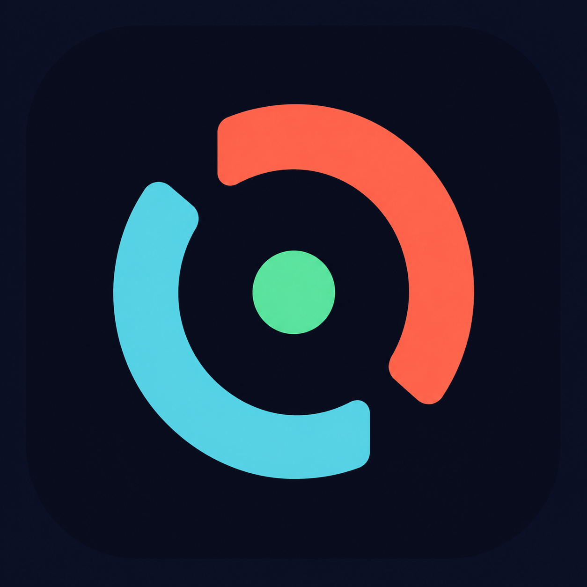
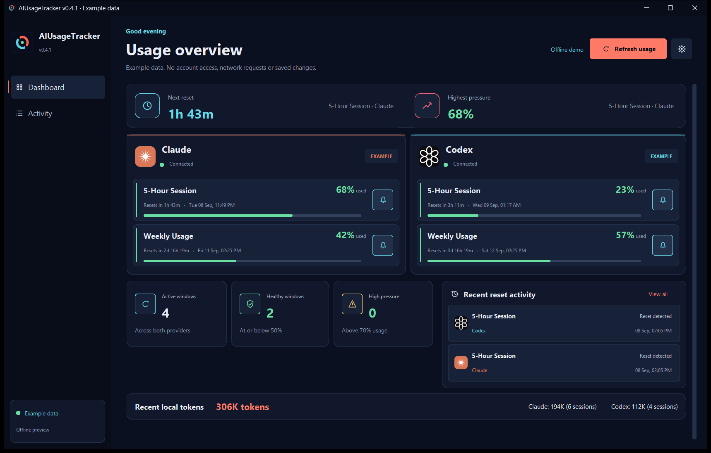
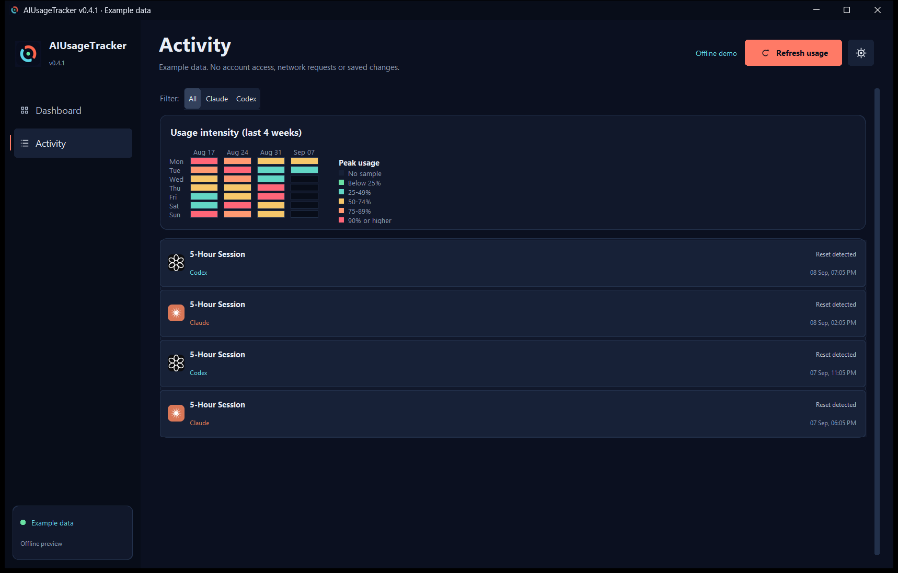
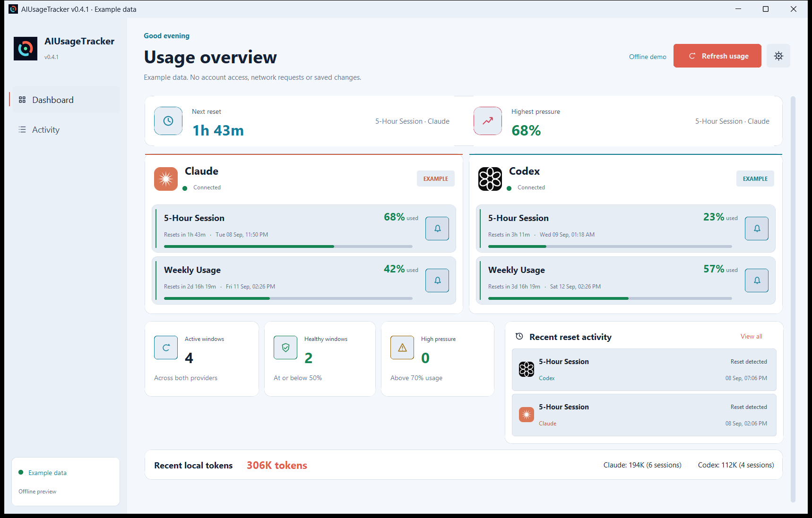
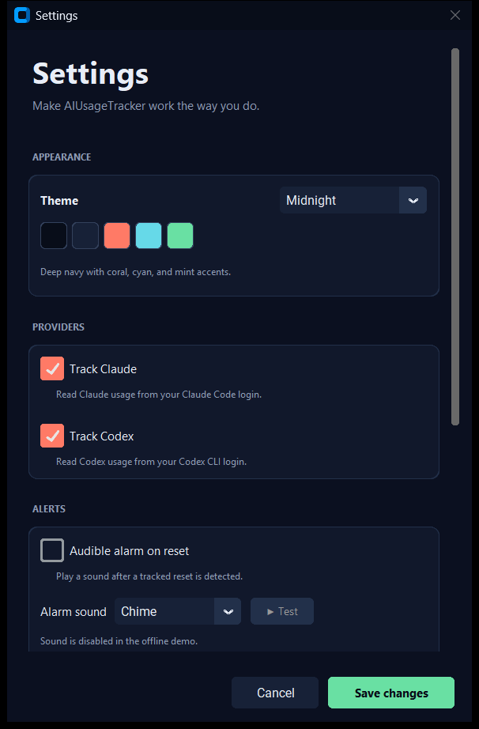

# AIUsageTracker v0.4.1

[](https://github.com/SysAdminDoc/AIUsageTracker/releases/tag/v0.4.1) [](LICENSE) [](https://github.com/SysAdminDoc/AIUsageTracker/releases) [](pyproject.toml)



Keep Claude and Codex quotas in one Windows dashboard. See how much of each window you've used, check the reset countdown, and choose which resets should alert you.

[Download the Windows installer](https://github.com/SysAdminDoc/AIUsageTracker/releases/download/v0.4.1/AIUsageTracker_Setup_0.4.1.exe) · [Portable ZIP](https://github.com/SysAdminDoc/AIUsageTracker/releases/download/v0.4.1/AIUsageTracker-portable-v0.4.1.zip) · [Setup and privacy guide](GUIDE.md)



Actual application capture using the built-in offline demo. The percentages and activity are examples, not a live account.

## Start here

You'll need Windows 10 or 11, plus a signed-in **Claude Code** or **Codex CLI** installation for live usage. You can use either provider on its own. A browser login alone isn't enough.

1. Install the Windows download above, or extract the portable ZIP and run `AIUsageTracker.exe`.
2. Open your CLI and sign in normally. The dashboard reads its saved login; there's no password field.
3. Select **Refresh usage**. Use the bell beside each quota to choose which reset alerts you want.

The EXE and installer are **unsigned**. Windows or your organization's policy may warn about them. Compare the download with [SHA256SUMS.txt](https://github.com/SysAdminDoc/AIUsageTracker/releases/download/v0.4.1/SHA256SUMS.txt), or [build from source](#run-from-source). Don't disable security controls to install it.

### Try it without an account

From the folder containing the executable:

```powershell
.\AIUsageTracker.exe --demo
```

Demo mode uses in-memory examples. It doesn't read credentials or local conversation logs, connect to providers, save settings, play sounds, or create a tray icon. Close it and relaunch without `--demo` when you're ready to use your accounts.

## What you can do

- **Compare usage without opening two settings pages.** Each provider gets its own card, with percentage-used bars and local reset times.
- Set reset alarms per window. Six tones, optional looping audio and Windows notifications are available in Settings.
- **Keep a small overlay nearby.** Mini mode shows the highest-used window. The system tray can show a usage percentage while the main window is hidden.
- Look back at detected resets in Activity. A four-week heatmap shows peak usage from samples the app has collected.
- Choose Midnight, Graphite or Daylight. Changes apply when you save Settings.
- Configure extra accounts and optional event hooks in the settings file. The [guide](GUIDE.md#advanced-settings) explains their limits and privacy implications.

### Reset history and usage patterns



The app records activity while it runs. It doesn't retrieve your provider's historical billing data.

<details>
<summary>See Daylight and Settings</summary>





</details>

## How alerts work

Regular background polling defaults to **180 seconds**. Known reset times can schedule an earlier check, but that check still respects the polling floor. A reset must be confirmed in returned data. Nearby reset events are grouped for five seconds before an alert appears.

That means alerts aren't guaranteed at the exact countdown boundary. Sleep, expired logins, network errors and provider rate limits can delay them. Leave the app running and keep the relevant CLI signed in.

## Your data

Live mode reads OAuth access tokens from the official CLI files and sends them to the matching provider's usage endpoint. It doesn't refresh tokens or rewrite the credential files.

The dashboard also reads local Claude Code session logs and the Codex log database for an **approximate recent-token summary**. This isn't a billing report or a strict 24-hour total. See [what gets read and saved](GUIDE.md#data-and-privacy).

Settings, usage samples and reset history stay in `%APPDATA%\AIUsageTracker`. Optional webhooks send reset messages to a destination you configure; event hooks run commands you supply. Both are off by default.

This is an unofficial project, not affiliated with Anthropic or OpenAI. Its usage endpoints are undocumented and may change.

## Run from source

Python 3.10 or newer is required. Release builds are tested with Python 3.13 on Windows 11.

```powershell
git clone https://github.com/SysAdminDoc/AIUsageTracker.git
cd AIUsageTracker
python -m venv .venv
.\.venv\Scripts\python.exe -m pip install -r requirements.txt
.\.venv\Scripts\python.exe run.py --demo
```

Omit `--demo` to use your saved CLI logins. A hash-pinned Windows/Python 3.13 dependency set is available in [requirements-lock.txt](requirements-lock.txt).

For terminal output, run one of these from the source checkout:

```powershell
.\.venv\Scripts\python.exe -m aiusagetracker.cli poll
.\.venv\Scripts\python.exe -m aiusagetracker.cli monitor
```

### Build and test

Install [Inno Setup 6](https://jrsoftware.org/isinfo.php), then:

```powershell
.\.venv\Scripts\python.exe -m pip install -r requirements-dev.txt
.\.venv\Scripts\python.exe -m pytest -q
.\build.ps1
```

The build stops if tests fail. It produces a portable EXE, a portable ZIP with licenses, and a per-user installer in `dist`. See [release verification](docs/VERIFICATION.md) for what was exercised and what still requires a live account.

## Help and project files

- [Troubleshooting and advanced settings](GUIDE.md)
- [Changelog](CHANGELOG.md) and [remaining work](ROADMAP.md)
- [Original artwork and screenshot review archive](assets/concepts/2026-09-08-marketing/README.md)
- [Report a problem](https://github.com/SysAdminDoc/AIUsageTracker/issues). Include your version and the error text, but never attach credential files.

Looking for a browser extension instead? [AI-Usage_Tracker](https://github.com/SysAdminDoc/AI-Usage_Tracker) is a separate project.

MIT. See [LICENSE](LICENSE) and [third-party notices](THIRD-PARTY-NOTICES.txt).
